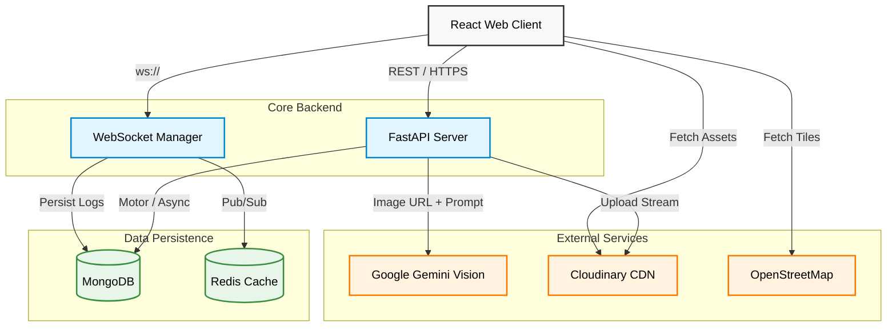
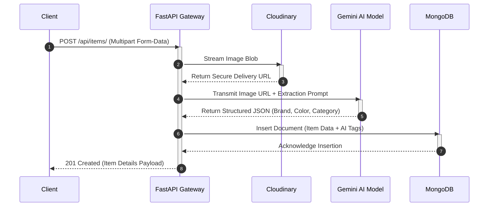
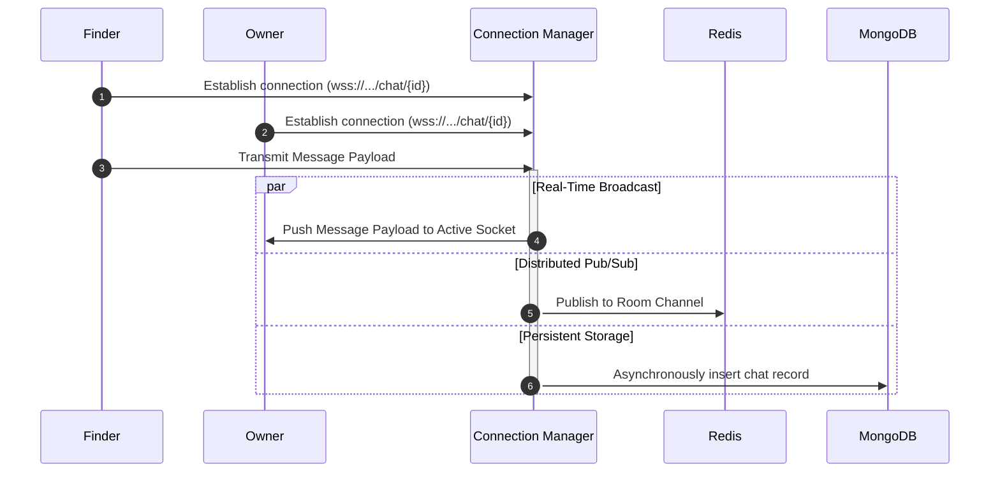

# Retriever

[](https://reactjs.org/)
[](https://fastapi.tiangolo.com/)
[](https://www.python.org/)
[](https://www.mongodb.com/)
[](https://www.docker.com/)

An intelligent campus lost and found management system utilizing Computer Vision and Large Language Models for automated metadata extraction and indexing.

Retriever streamlines the recovery of lost items by automatically processing user-uploaded images through the Google Gemini Vision API to extract descriptive tags (color, brand, category). This data is seamlessly indexed to provide a highly accurate, map-integrated search experience.

---

## Capabilities

- **Automated Metadata Extraction**: Leverages the Google Gemini Vision API to automatically identify and tag uploaded items with attributes such as brand, primary color, and category.
- **Real-Time Communication**: Integrates an asynchronous WebSocket chat system, enabling direct, persistent, and secure messaging between finders and owners.
- **Geospatial Tracking**: Utilizes interactive Leaflet maps combined with the OpenStreetMap Nominatim API for precise coordinate plotting and geocoding.
- **Automated Document Generation**: Dynamically generates high-resolution, printable "WANTED" flyers for lost items, complete with scannable QR codes for quick system access.
- **Scalable Media Storage**: Implements Cloudinary for secure, production-grade Content Delivery Network (CDN) image storage, featuring intelligent fallback to local static file serving.
- **Workflow State Management**: Supports full item lifecycle management, allowing users to transition items to a "Resolved" state, which automatically archives associated chat sessions.

---

## Architecture Design

Retriever employs a Modular Monolith architecture, guaranteeing a strict separation of concerns through the Controller-Service-Repository pattern while minimizing operational complexity.

### High-Level System Architecture



### Automated Vision Pipeline

The following sequence details the intelligent tagging workflow triggered upon item submission:



### Real-Time WebSocket Infrastructure

The chat architecture guarantees immediate message delivery while ensuring robust historical persistence.



---

## Technical Stack

- **Client Infrastructure**: React 19, Vite, Tailwind CSS v4, Framer Motion, React-Leaflet
- **Application Server**: FastAPI, Pydantic, Uvicorn (ASGI)
- **Data Layer**: MongoDB (Motor Async Driver), Upstash Redis
- **Integrations**: Google Gemini 1.5 Flash, Cloudinary SDK, OpenStreetMap
- **DevOps**: Docker, Docker Compose, GitHub Actions (CI/CD)

---

## Getting Started

### Prerequisites
- Docker and Docker Compose
- Node.js environment (optional, for local client debugging)
- Google AI Studio API Key (Gemini)

### Local Deployment (Dockerized)

1. Clone the repository:
   ```bash
   git clone https://github.com/Myself-Praveen/Retriever.git
   cd Retriever
   ```

2. Establish the environment configuration in `backend/.env`:
   ```env
   MONGO_URL=mongodb://mongodb:27017
   GEMINI_API_KEY=your_google_ai_key
   REDIS_URL=redis://redis:6379
   JWT_SECRET=super_secret_key
   ```

3. Initialize the containers:
   ```bash
   docker-compose up --build
   ```

4. Validate the deployment:
   - Client Application: `http://localhost:5173`
   - API Documentation (OpenAPI/Swagger): `http://localhost:8000/docs`

---

## Contributing
We enforce rigorous code quality standards. Ensure all local tests pass by executing `pytest` and `flake8` prior to submitting a Pull Request. Continuous Integration pipelines will automatically reject non-compliant submissions.
